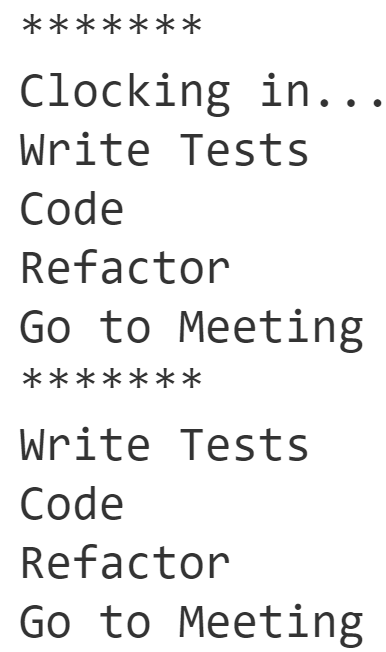

# Chapter 2 Node fundamentals: Event Emitter
## Objectives:
* Practice with Node's EventEmitter 
* Raise Events using EventEmitter's emit()
* Create named handlers and inline functions
* Practice with on and once 

## Dir/File setup

1. In your `\WIP` directory, create the directory structure `\WIP\Ch02\events`

1. Create a file called `events.js`

Read through the high-level steps. If you need additional help - scroll down, and do the more detailed steps. 

You can also refer to the event demos.

Or you can look at solution  - see if you understand it - and then recreate it.

If you need additional help, ask your instructor or fellow students. 

## High level steps (Detailed steps below if you need help)
* Create an app that raises an event 'work' twice.
* This will produce the following output.

    

* Notice the first time the event is raised the message Clocking in... appears.
* The next time the event is raised, Clocking in... is not used.
* For both the first and second times, what is outputted are the steps for TDD. 
* Write code that includes functions to represent each of these steps. Use emitter.on or emitter.once to register the correct functions to fire on the work event.

## Detailed Steps

1. Require the events module and store it in a reference called events and create an Event Emitter using the keyword new.

    

    Note: Here we are NOT looking in the local file system for a module as we are not using path indicators such as "./filename" but instead using simply **events**

2. Register a function handler that prints the step of **Writing Tests** to the console.
   
    

1. Now register this event to fire every time a work event is raised. (we will later emit a work event)

    

1. Now, fire off a work event.

    

1. Test that your code works and that you see the message Write Tests.

2. For an event that only fires once, use **once** 

    

   
3. Now test your code by emitting the work event twice.

    
   
4. Examine your output to see if it worked. Is the output in the right order? The order that you register events is important. Make sure that Clocking in, is before the function handler for Write Tests.

1. Follow the same process to get the rest of the output as shown above - including printing stars at the beginning of the output.
   
2. Refer to the solution or ask instructor if you need additional help.

1. Mark your work as complete before moving to the bonus.
   
## Bonus #1

1. If done before others, create another type of event called 'break'.

2. When the 'break' event is omitted print out 'Check Emails'. You can put this in a named function handler, and add it to be called when the 'work' event is emitted too.

## Bonus #2

1. use setInterval and Math.random to create a number 1 to 20 - when it is 11 - raise an event called `sighting`. 

1. run the code and watch for the output

1. when exiting the program - use process - indicate how many times 11 was sighted.

